# Slate UI

A modern parametric control panel for Grasshopper — an alternative to Human UI, built as a WebView2/Svelte interface instead of native WinForms.

> **Status:** early, actively developed. Expect rough edges. Feedback and bug reports welcome.

## Why Slate

Grasshopper definitions often need a clean control surface for clients or teammates who shouldn't have to touch the canvas. Slate captures your existing sliders, toggles, buttons, panels and other controls into a floating panel. State (layout, tabs, groups, captured controls) is saved with your `.gh` file, so a saved definition reopens with its panel exactly as you left it.

**Edit mode.** Every panel starts empty. Flip the `Tab / Edit` toggle at the bottom to enter edit mode, where you can capture and rearrange controls; flip back and the panel becomes a clean, read-only surface for clients.

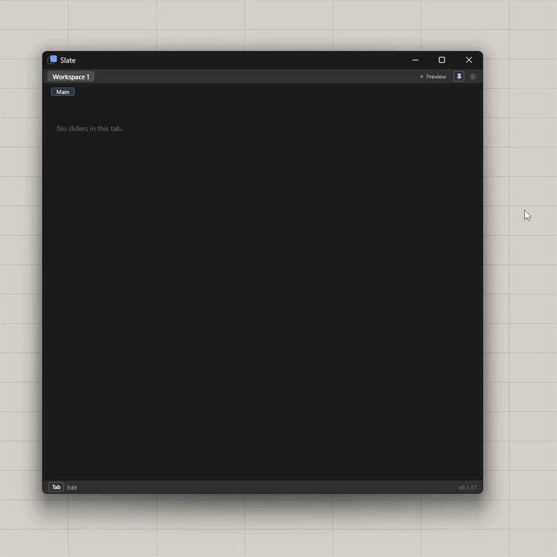

**Capturing controls.** Select sliders, toggles, buttons, panels and other controls on the GH canvas, then pull them into a tab with the capture button. Wide control coverage: sliders, boolean toggles, buttons, value lists (dropdown/checklist/sequence), text panels, item pickers, colour swatches — plus, read via reflection with no compile-time dependency on either plugin, [Human UI](https://www.food4rhino.com/en/app/human-ui)'s Item Selector and [Pancake](https://www.food4rhino.com/en/app/pancake)'s True Only Button.

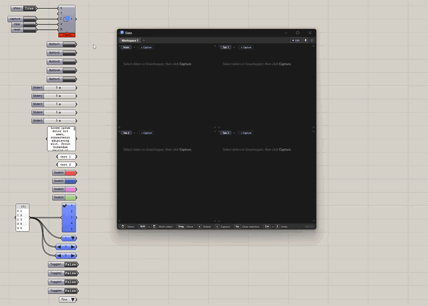

**Multi-panel layout.** Split the window into resizable panes from any corner, each with its own tabs. Panes snap into place as you resize, including an invisible 50% midpoint snap.

<table>
<tr>
<td width="50%">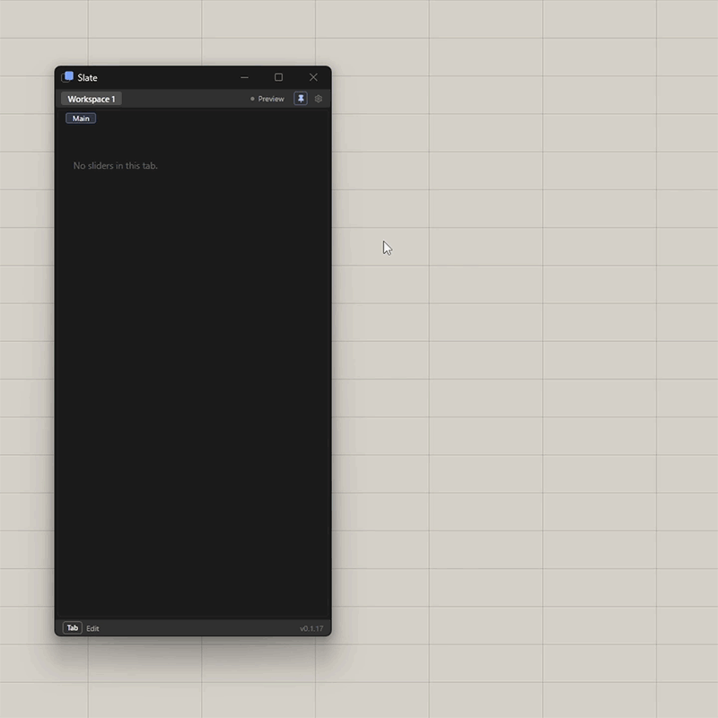<br>Resizing the panel</td>
<td width="50%">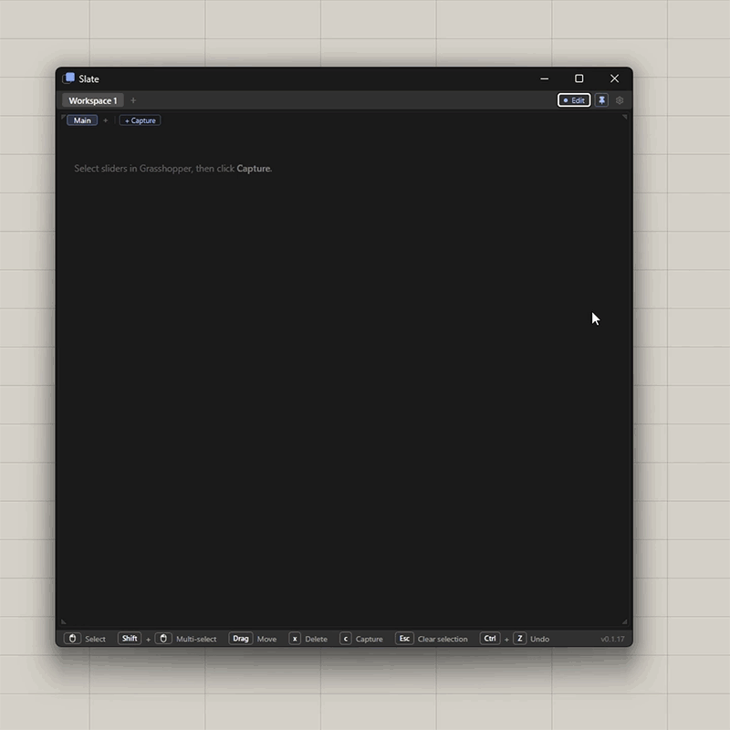<br>Splitting into panes</td>
</tr>
<tr>
<td>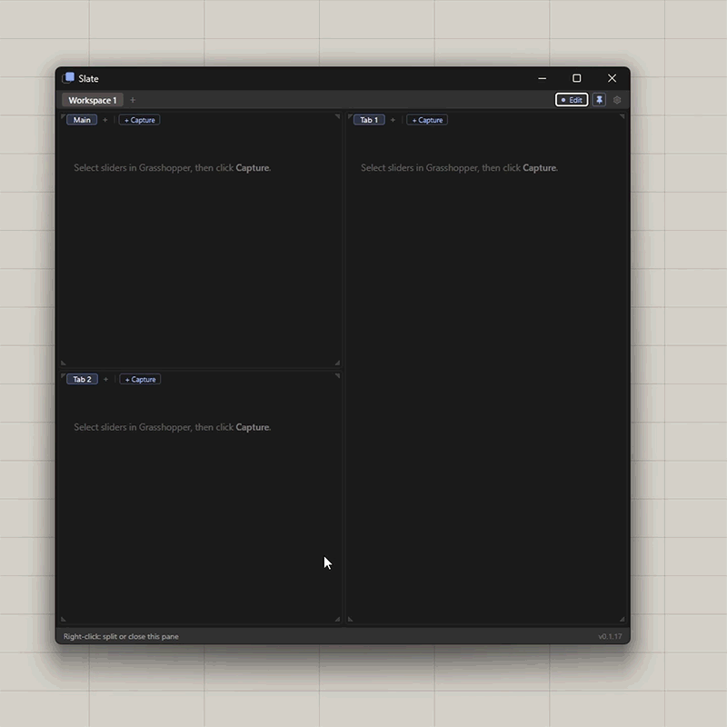<br>Snapping panes into place</td>
<td></td>
</tr>
</table>

**Detaching.** Pull a tab out into its own floating window when you want it on a second monitor or out of the way.

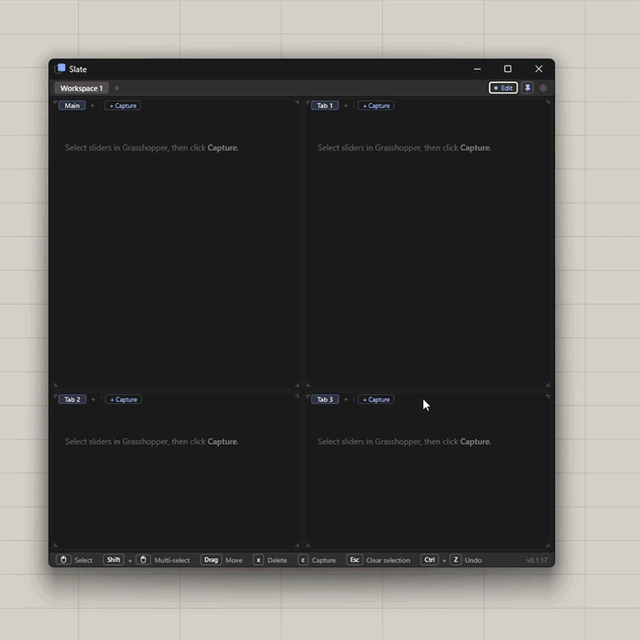

**Multiple workspaces.** Separate tab sets per workspace, saved per `.gh` file, quick-switch with `Ctrl+1–9`.

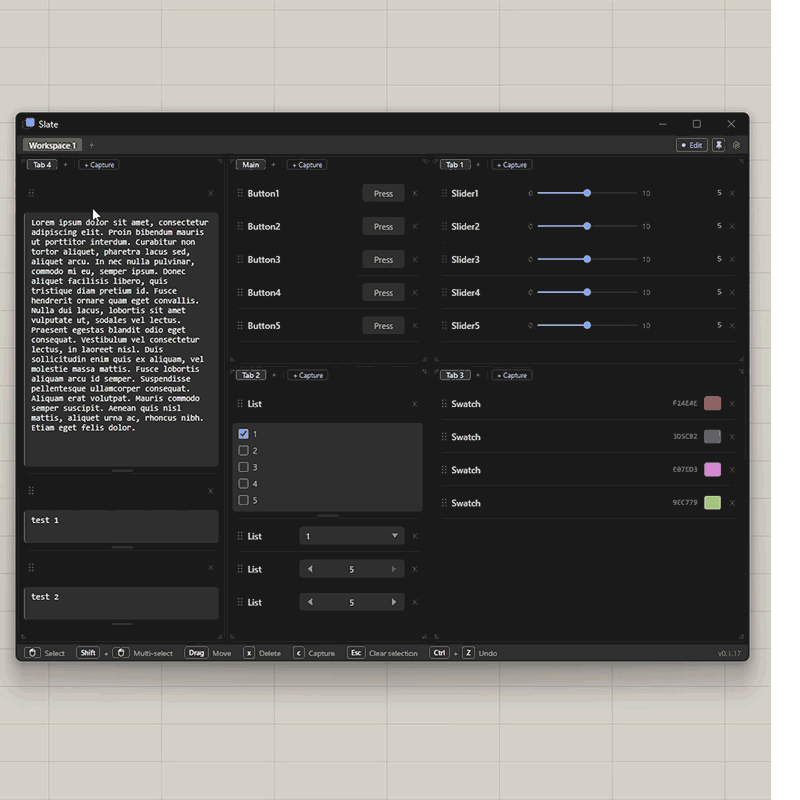

**Groups and drag-and-drop.** Collapsible, nestable groups with a one-click "capture selected" button. Drag-and-drop works everywhere — reorder, move between tabs, move between panes, drop into groups.

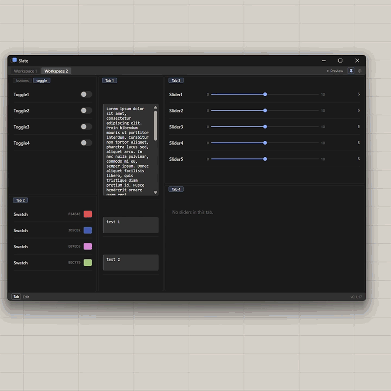

**Themes.** Dark and light themes, plus per-tab colour tagging with a custom HSLA/RGBA colour picker (8-digit hex, `#RRGGBBAA`, supported).

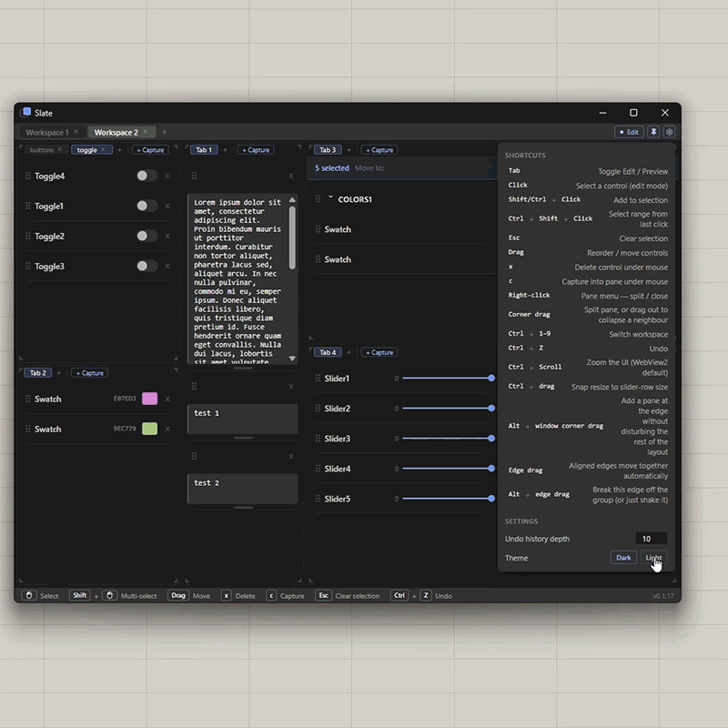

**Closing and deleting.** Tabs, panes, and groups can all be closed or removed directly from the panel.

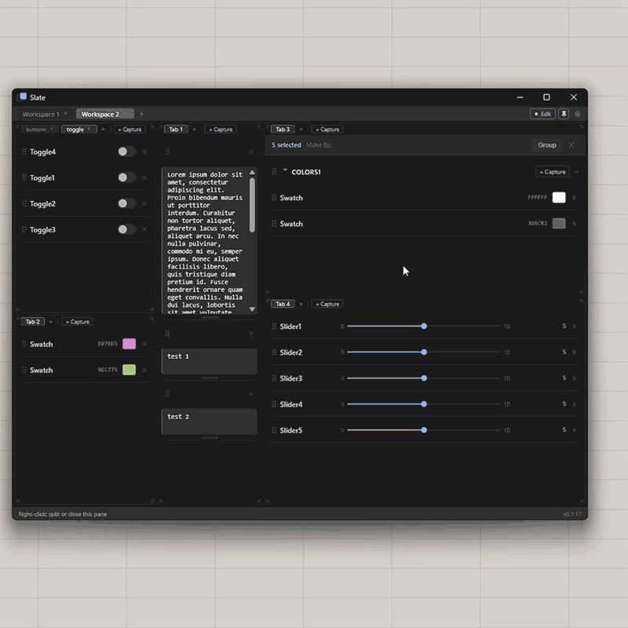

**Undo** (`Ctrl+Z`) with a configurable history depth.

Put it all together and a fully built-out panel looks like this:

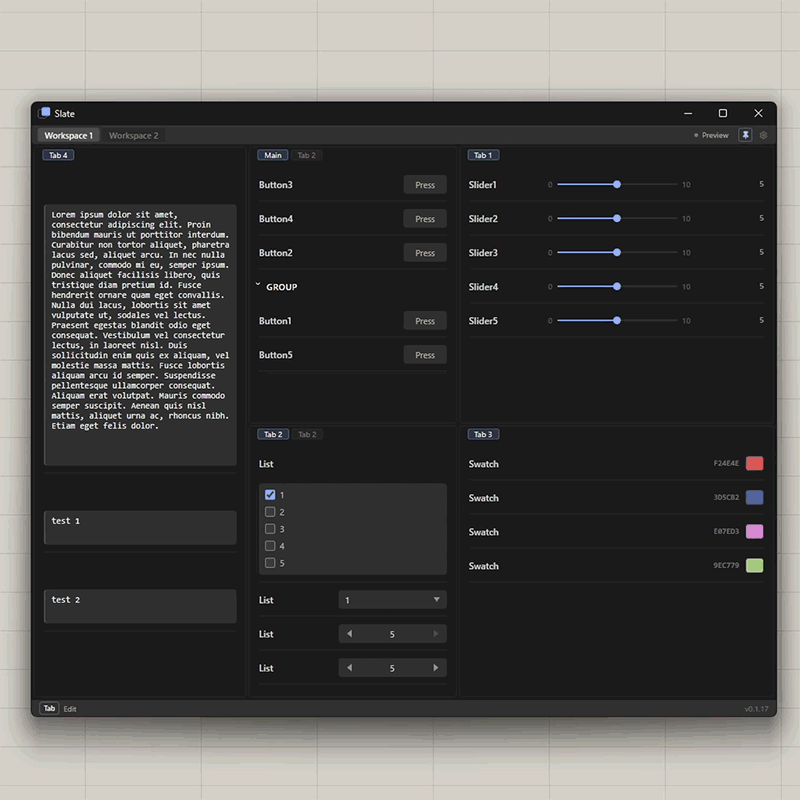

## Requirements

- Rhino 7 or 8, Windows
- [Microsoft Edge WebView2 Runtime](https://developer.microsoft.com/microsoft-edge/webview2/) — Slate's panel is a WebView2 (Chromium) control; the runtime ships with Windows 10/11 by default, so most people already have it
- **Windows only.** Slate embeds WebView2 via WinForms — there is currently no macOS build and none is planned unless the underlying dependency changes.

## Installation

<!-- TODO: once published — `_PackageManager` search "Slate" (Yak), or Food4Rhino link -->

Not yet published to a package manager. For now, build from source (below) and copy the resulting `Slate.gha` into your Grasshopper `Libraries` folder.

## Building from source

```powershell
# 1. Build the Svelte UI (embedded into the .gha as a resource)
cd ui
npm install
npm run build

# 2. Build the plugin (Rhino must be closed)
cd ../src
dotnet build Slate.csproj
```

Or run `.\build.ps1` from the repo root, which does both steps, closes/reopens Rhino, and deploys the built `.gha` to `%APPDATA%\Grasshopper\Libraries` automatically.

## License

[MIT](LICENSE). Third-party notices (icons) in [NOTICE.md](NOTICE.md).
